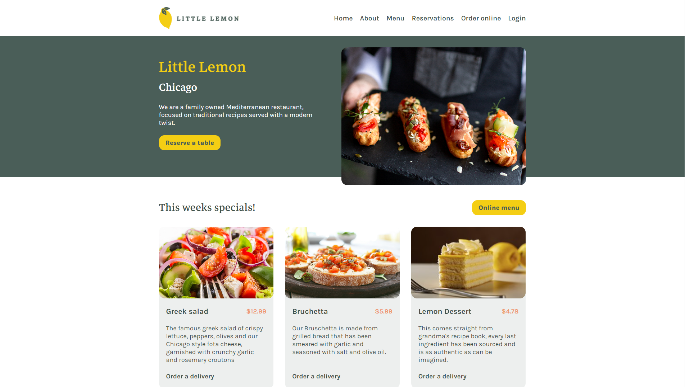

# 🍋 Little Lemon

We are a family owned Mediterranean restaurant, focused on traditional recipes served with a modern twist.

Final project for the [Coursera+Meta](https://www.coursera.org/learn/meta-front-end-developer-capstone) course "Front-End Developer Capstone".

<p align="center">
  
  <span>Project Interface</span>
</p>

<p align="center">
  
  
  
</p>

## 📂 Boilerplate

This project was bootstrapped with [Vite](https://vitejs.dev/guide/#scaffolding-your-first-vite-project).

## 💻 Technologies

* [Node](https://nodejs.org/en/)
* [React](https://reactjs.org/)
* [Vite](https://vitejs.dev/)

## 🏃 Getting Started

First, clone this repository and access the created folder:

```bash
# Cloning repository
git clone https://github.com/iamtheluiz/little-lemon-website.git

cd little-lemon-websit/
```

Inside the folder, install all project dependencies:

```bash
npm install
# or
yarn install
```

## 👨🏽‍💻 Usage

To run this project in a local environment use:

```bash
npm run dev
# or
yarn dev
```

Then open [http://localhost:5173](http://localhost:5173) to view it in the browser.

## ⚙️ Build

To build this project, run:

```bash
yarn build
```

Await the script and you will have a folder "/dist" in your project root with all generated static files.

## 🧪 Test

To run tests, use:

```bash
yarn test
```

## 💼 Authors

* **Luiz Gustavo** - *Development* - [iamtheluiz](https://github.com/iamtheluiz)
  * Website: https://iamtheluiz.github.io
  * Github: [@iamtheluiz](https://github.com/iamtheluiz)
  * LinkedIn: [Luiz Gustavo da Silva Vasconcellos](https://www.linkedin.com/in/luiz-gustavo-da-silva-vasconcellos-05192a192?lipi=urn%3Ali%3Apage%3Ad_flagship3_profile_view_base_contact_details%3BbQkVQ3sTTv6XCn%2FiToGGcA%3D%3D)
